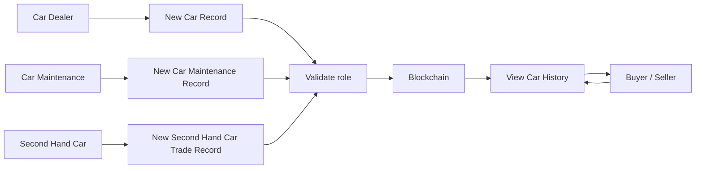
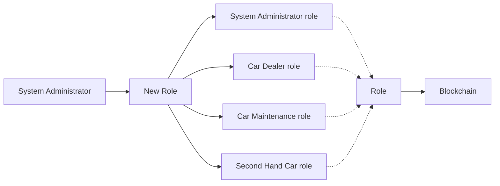
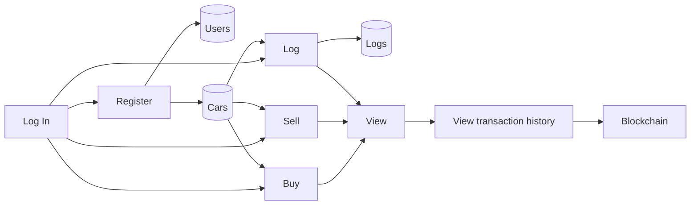

# Second-Hand Car Trade dApp

A Next.js + Web3 dApp for recording and viewing a vehicle’s on-chain history. An Ethereum smart contract tracks role-based actions: adding new cars, logging maintenance, and recording ownership changes. Users search by VIN to see the history.

## Features
- Search by VIN to view all recorded transactions (date, location, details).
- Role management (admin assigns): Admin, Car Dealer, Car Maintenance, Second-Hand Car Trade.
- Role-gated actions:
  - New car entry (`/newcar`) by Car Dealer.
  - Maintenance log (`/carmaintenance`) by Car Maintenance.
  - Ownership change (`/changeowner`) by Second-Hand Car Trade.

## Roles and permissions
- **Admin**: Default role for the deployer. Can grant roles to other addresses (Admin, Car Dealer, Car Maintenance, Second-Hand Car Trade).
- **Car Dealer**: Can record a new car’s first entry via `newCar`.
- **Car Maintenance**: Can log maintenance events via `maintenance`.
- **Second-Hand Car Trade**: Can log ownership changes via `changeOwner`.

Calls to the contract will revert unless the sender has the required role. Use `/newrole` to assign roles before performing actions.

## Prerequisites
- Node.js (v16+ recommended).
- MetaMask (for interacting with Sepolia testnet).
- Sepolia test ETH for the deployer account.

## Install
```bash
npm install
```

## Environment
Create `.env.local` in the repo root (already gitignored):
```
DEPLOY_MNEMONIC="your twelve word seed"
DEPLOY_RPC_URL="https://sepolia.infura.io/v3/<project-id>"   # or another Sepolia RPC
NEXT_PUBLIC_RPC_URL="https://sepolia.infura.io/v3/<project-id>"
```
Use the same funded wallet in MetaMask (Sepolia) as `DEPLOY_MNEMONIC`.

## Compile the contract
```bash
node ethereum/compile.js
```
Outputs ABI/bytecode to `ethereum/build/transaction.json`.

## Deploy the contract (Sepolia)
```bash
node ethereum/deploy.js
```
- Ensure `DEPLOY_MNEMONIC` and `DEPLOY_RPC_URL` are set.
- The deployer account (derived from the mnemonic) must have Sepolia ETH.
- The script prints `Contract deployed to <address>`.

Update the frontend contract address in `ethereum/transaction.js` to the deployed address (or refactor to read from an env var).

## Run the app
```bash
npm run dev
# visit http://localhost:3000
```
- Connect MetaMask to Sepolia.
- The deployer is Admin; assign roles via `/newrole` before using `/newcar`, `/carmaintenance`, `/changeowner`.

## Creating transactions (role-gated)
1) Connect MetaMask to Sepolia with the account that has the required role.
2) Open the relevant page:
   - `/newcar` (Car Dealer)
   - `/carmaintenance` (Car Maintenance)
   - `/changeowner` (Second-Hand Car Trade)
3) Fill VIN, date, location, and details; submit.
4) MetaMask prompts to sign/send the transaction; gas is paid by the connected account.
5) On-chain call succeeds only if the sender has the matching role; otherwise it reverts.

## Visuals
### Role-gated transaction recording

This flow shows each role submitting its transaction type; the contract enforces the role check before writing to chain, and anyone can read history.

### Role assignment

The deployer (admin) assigns roles; those roles gate access to contract methods.

### High-level app flow

This summarizes user entry, car records, logs, and viewing transaction history backed by the blockchain.

## Tests
Contract tests (Ganache in-memory):
```bash
npm test
```

## Notes
- Routes are defined in `routes.js`.
- Provider and mnemonic are injected via env vars; do not commit secrets.
