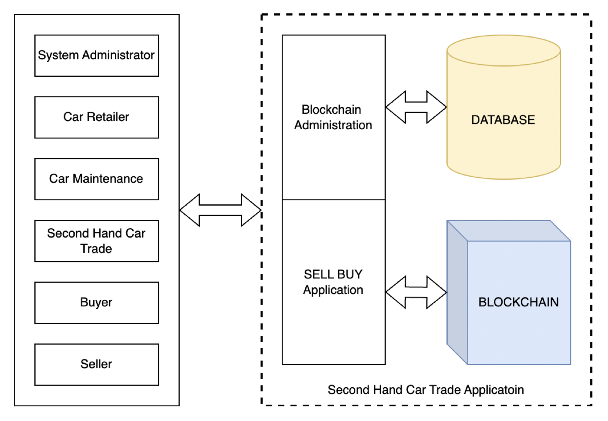
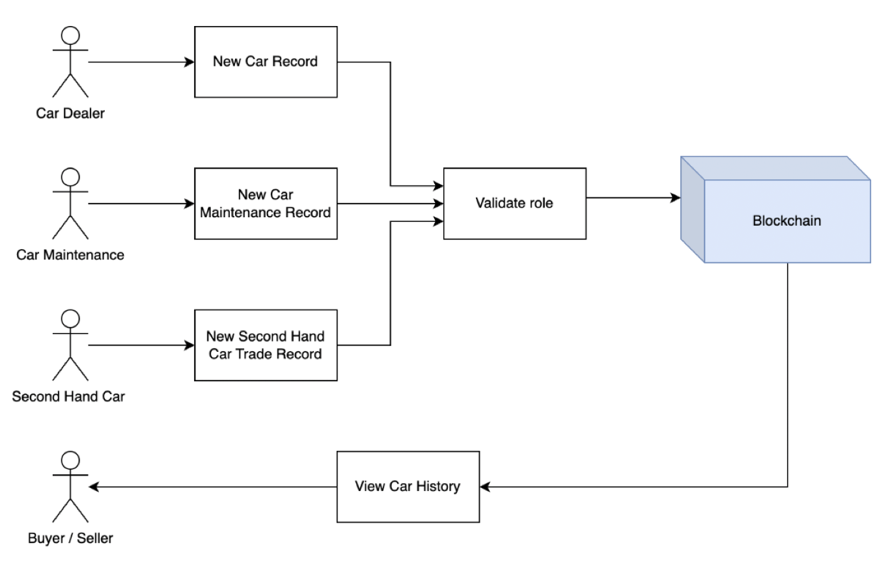
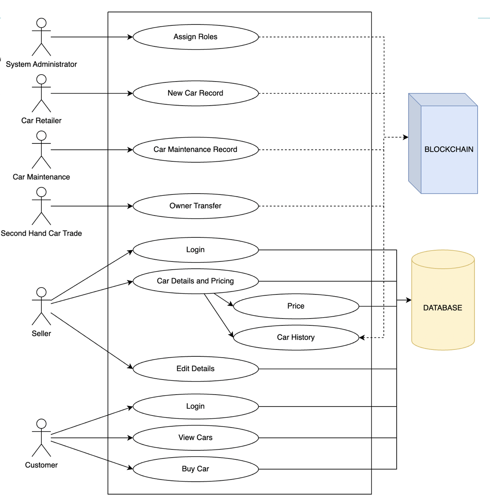
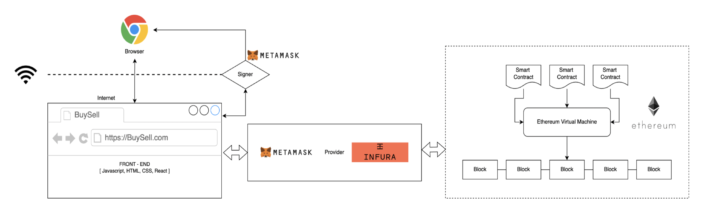
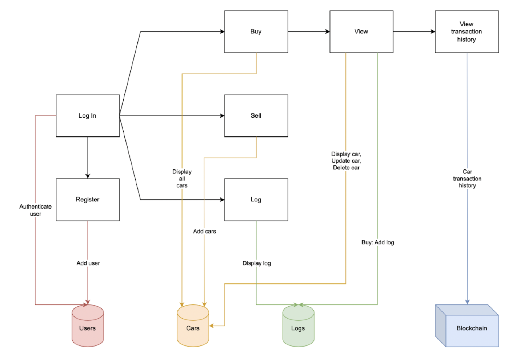

# Second-Hand Car Trade dApp

A Next.js + Web3 dApp for recording and viewing a vehicle’s on-chain history. An Ethereum smart contract tracks role-based actions: adding new cars, logging maintenance, and recording ownership changes. Users search by VIN to see the history.

## Motivation
### Why? (Scope)
- Primary motivation: Pre-owned car ownership cost is cheaper than new ones.
- Pandemic situation: People started preferring individual mobility.
- Trends in India: Growing middle class, young population and steady increase in disposable income.

### Traditional method - Disadvantages
- Data asymmetry between buyer and seller
- Lack of trust
- Tedious paperwork

## Why BlockChain?

1) Distributed ledger - Decentralised database -  Data transparency and Traceability
2) Consensus algorithm - Data integrity and Reliability
3) Smart contracts - Automate business logic

## PROBLEM STATEMENT
One of the major concerns of traditional second hand car trade system is data asymmetry and lack of trust between buyers and sellers. To address this problem we use distributed ledger system to develop a second hand car trade system to track the car history.

## Quickstart
1) Install: `npm install`
2) Configure `.env.local` with mnemonic, RPC, and contract address (see Environment).
3) Set the deployed Sepolia contract address in `ethereum/transaction.js` or expose it via an env var (preferred).
4) Run: `npm run dev` and open http://localhost:3000; connect MetaMask to Sepolia and use the funded deployer/admin account first.

## USE CASE diagrams
These diagrams outline who interacts with the platform and why: the system administrator assigns roles, blockchain roles gate which actions can be taken, and buyers/sellers/maintainers log and review vehicle history so trust is built with transparent on-chain data.
### Simple USE CASE Diagram


### System administrator responsibilities


### Blockchain Transactions


### Blockchain administration - Roles and responsibilities


## System Design
High-level design shows the customer-facing Next.js app talking to the Ethereum smart contract: clients connect via wallet, submit role-gated transactions (new car, maintenance, ownership change), and read history directly from the chain for a tamper-evident record.



### Customer Side Application Flow


## UI Screens
Screenshots show how users assign roles, submit transactions, and confirm on-chain writes with wallet prompts and Etherscan proof.

### Assign roles (admin)


### Create and view transactions


### On-chain confirmations


## Features
- Search by VIN to view all recorded transactions (date, location, details).
- Role management (admin assigns): Admin, Car Dealer, Car Maintenance, Second-Hand Car Trade.
- Role-gated actions:
  - New car entry (`/newcar`) by Car Dealer.
  - Maintenance log (`/carmaintenance`) by Car Maintenance.
  - Ownership change (`/changeowner`) by Second-Hand Car Trade.

## Roles and permissions
- **Admin**: Default role for the deployer. Can grant roles to other addresses (Admin, Car Dealer, Car Maintenance, Second-Hand Car Trade).
- **Car Dealer**: Can record a new car’s first entry via `newCar`.
- **Car Maintenance**: Can log maintenance events via `maintenance`.
- **Second-Hand Car Trade**: Can log ownership changes via `changeOwner`.

Calls to the contract will revert unless the sender has the required role. Use `/newrole` to assign roles before performing actions.

## Prerequisites
- Node.js (v16+ recommended).
- MetaMask (for interacting with Sepolia testnet).
- Sepolia test ETH for the deployer account.

## Wallet setup & funding (Sepolia)
- Enable test networks in MetaMask (Settings → Advanced → Show test networks) and select the built-in Sepolia network (Chain ID 11155111, symbol ETH; RPC can be your Infura URL).
- Create a fresh account in MetaMask (Account menu → Add account) and copy its address (must be an EOA, not a contract).
- Fund it with Sepolia ETH, e.g. Google Cloud faucet: `gcloud alpha web3 faucet send-eth --network=sepolia --address=<YOUR_0x_ADDRESS>`.
- Verify on https://sepolia.etherscan.io that the balance increased and there are no internal transfers sending funds away.
- Use this funded account as the deployer/admin (it grants roles to others).

## Install
```bash
npm install
```

## Environment
Create `.env.local` in the repo root (already gitignored):
```
DEPLOY_MNEMONIC="your twelve word seed"
DEPLOY_RPC_URL="https://sepolia.infura.io/v3/<project-id>"   # or another Sepolia RPC
NEXT_PUBLIC_RPC_URL="https://sepolia.infura.io/v3/<project-id>"
NEXT_PUBLIC_CONTRACT_ADDRESS="<deployed-sepolia-address>"     # preferred: feed frontend from env
```
Use the same funded wallet in MetaMask (Sepolia) as `DEPLOY_MNEMONIC`.

## Contract address and network
- **Network**: Sepolia (configure MetaMask to Sepolia).
- **Contract address**: set `NEXT_PUBLIC_CONTRACT_ADDRESS` in `.env.local`; alternatively, update `ethereum/transaction.js` with the deployed address printed by `deploy.js`.
- **Wallet**: use the deployer/admin account (from the mnemonic) to grant roles before others can write.

## Compile the contract
```bash
node ethereum/compile.js
```
Outputs ABI/bytecode to `ethereum/build/transaction.json`.

## Deploy the contract (Sepolia)
```bash
node ethereum/deploy.js
```
- Ensure `DEPLOY_MNEMONIC` and `DEPLOY_RPC_URL` are set.
- The deployer account (derived from the mnemonic) must have Sepolia ETH.
- The script prints `Contract deployed to <address>`.

Update the frontend contract address in `ethereum/transaction.js` to the deployed address (or refactor to read from an env var).

## Run the app
```bash
npm run dev
# visit http://localhost:3000
```
- Connect MetaMask to Sepolia.
- The deployer is Admin; assign roles via `/newrole` before using `/newcar`, `/carmaintenance`, `/changeowner`.

## Creating transactions (role-gated)
1) Connect MetaMask to Sepolia with the account that has the required role.
2) Open the relevant page:
   - `/newcar` (Car Dealer)
   - `/carmaintenance` (Car Maintenance)
   - `/changeowner` (Second-Hand Car Trade)
3) Fill VIN, date, location, and details; submit.
4) MetaMask prompts to sign/send the transaction; gas is paid by the connected account.
5) On-chain call succeeds only if the sender has the matching role; otherwise it reverts.

## Build & deploy
- Development: `npm run dev` (Sepolia).
- Production build: `npm run build` then `npm start`.
- Ensure `.env.local` (or production env) includes RPC and `NEXT_PUBLIC_CONTRACT_ADDRESS` for the target network.

## Tests
Contract tests use a local in-memory chain (Ganache/Hardhat). Make sure dependencies are installed, then:
```bash
npm test
```
This compiles contracts and runs the suite against the local chain. Start Ganache/Hardhat if your setup requires a running node, and ensure env vars match that RPC before running.

## Notes
- Routes are defined in `routes.js`.
- Provider and mnemonic are injected via env vars; do not commit secrets.
